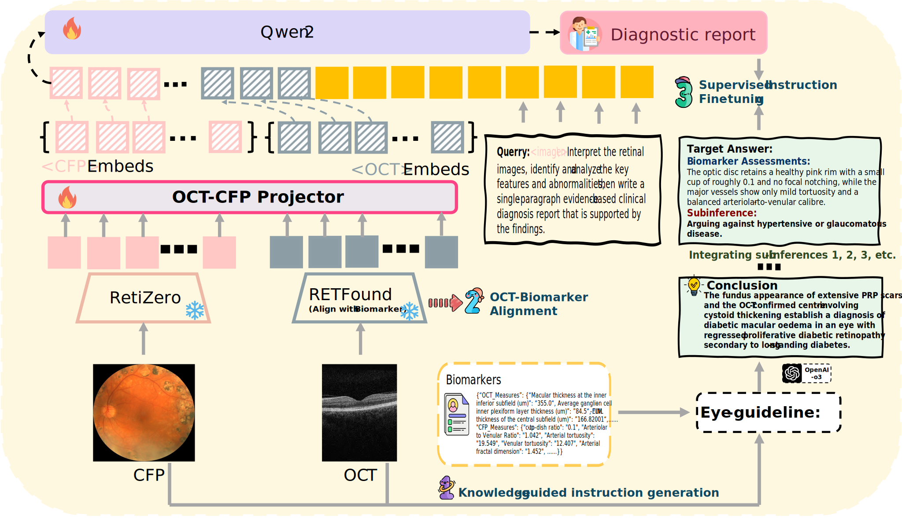

# GROK: From Quantitative Biomarkers to Qualitative Diagnosis via a Grounded MLLM with Knowledge-Guided Instruction
---
GROK is the first MLLM that jointly processes CFP, OCT, and text
to deliver clinician-grade diagnoses of ocular and systemic
disease. GROK comprises three core modules—Knowledge-Guided
Instruction Generation, CLIP-Style OCT–Biomarker Alignment,
and Supervised Instruction Fine-Tuning—that together instill a
quantitative-to-qualitative diagnostic chain-of-thought, mirroring
real clinical reasoning when producing detailed lesion annotations.
To evaluate our approach, we introduce the Grounded Ophthalmic
Understanding benchmark, which covers six disease categories
and three tasks—macro-level diagnostic classification, report
generation quality, and fine-grained clinical quality assessment of
the generated chain-of-thought. Experiments show that, with only
LoRA (Low-Rank Adaptation) fine-tuning of a 7B-parameter
Qwen2 backbone, GROK outperforms comparable 7B and
32B baselines on both report quality and fine-grained clinical
metrics—and even exceeds OpenAI-o3.
## Model Architecture

Below is the diagram of the model structure:

## 🔥 Model Training:

- `stage_one: Knowledge-guided instruction generation`  
  First, generate the dataset according to **stage_one**.

- `stage_two: OCT–Biomarker Alignment`  
  Next, train **RETFound** with **CLIP-style** alignment so that OCT features are semantically fused with the OCT biomarkers.

- `Final step ` 
  Use the **stage_two–trained RETFound** as the **OCT encoder**, and **RetiZero** ([link](https://github.com/LooKing9218/RetiZero)) as the **CFP encoder**, then **fine-tune Qwen2**.

## Referenced Models:
This work uses and introduces several additional models; if anything is unclear, please refer to the following.

**RetiZero** ([code](https://github.com/LooKing9218/RetiZero)) ([paper](https://arxiv.org/abs/2406.09317))
RetiZero is the CFP encoder

**RETFound** ([code](https://github.com/rmaphoh/RETFound_MAE)) ([paper](https://www.nature.com/articles/s41586-023-06555-x))
RETFound is the OCT encoder

**Qwen2** ([code](https://github.com/QwenLM/Qwen2.5-VL)) ([paper](https://arxiv.org/abs/2407.10671))
Qwen2 is the large language model

**Alignment** 
For the theoretical foundations of tabular–OCT alignment, please refer to the following. ([paper](https://arxiv.org/abs/2303.14080))

