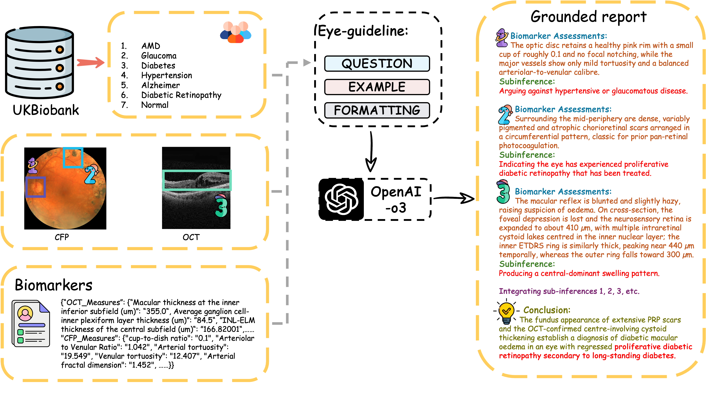

# stage_one: Knowledge-guided instruction generation
## Data preprocessing (Geneartion diagnosis label from UKBiobank)

### Hypertension
***1.*** **Self-reported doctor‐diagnosed hypertension (Field ***6150***):**  
– Include only participants who reported hypertension and no other vascular/heart conditions; exclude anyone who reported multiple conditions including hypertension.  
– Label those who selected “None of the above” as normotensive.  
– After this filtering, ***121,033*** individuals are classified as hypertensive and ***350,662*** as normal.

***2.*** **Blood pressure measurements (systolic and diastolic):**  
– For each participant, compute the average of automated and manual readings of systolic blood pressure (SBP), and similarly for diastolic blood pressure (DBP).  
– Classify anyone with average SBP ≥ 140 mmHg or average DBP ≥ 90 mmHg as hypertensive; otherwise, label as normal.  
– Merge these measurement‐based labels with the self‐report results from Step ***1***. After combining, there are ***252,047*** hypertensive and ***219,648*** normal individuals.

***3.*** **Medication records (Fields ***6153*** and ***6177***):**  
– Identify participants who take only “blood pressure medication” (and no medications for cholesterol, diabetes, etc.) and label them as hypertensive.  
– Label those who selected “None of the above” as normal.

***4.*** **Final merging:**  
– Combine the medication‐based labels from Step 3 with the combined self‐report and measurement labels from Step 2.  
– In the end, ***202,005*** individuals are classified as hypertensive and ***204,996*** as normal. 
### Age-related Macular Degeneration (ADM)
1) **ICD-10 main diagnosis** (UKB Field **41202**)  
   - If any column equals **`H353`** (age-related macular degeneration), set **amd = 1**; otherwise **amd = 0**.

2) **Which eye(s) affected by macular degeneration** (Field **5912**)  
   - This field records laterality: typically **1 = left**, **2 = right**, **3 = both**.  
   - If counting “any affected” as positive: values **∈ {1, 2, 3}** are positive.  
   - If counting “both eyes only”: value **= 3** is positive.

3) **Age macular degeneration diagnosed** (Field **5923**)  
   - If the value is **> 0** (a diagnosis age exists), mark as positive.

4) **Eye problems/disorders** (Field **6148**)  
   - If any instance equals **5** (corresponding to AMD), mark as positive.

5) **Non-cancer illness code, self-reported** (Field **20002**)  
   - If any instance equals **1528** (macular degeneration), mark as positive.
### Glaucoma
1) **ICD-10 main diagnosis** (UKB Field **41202**)  
   - If any column equals **H40.\*** (glaucoma; e.g., **H401/H408/H409**) or **H42.\***, set **glaucoma = 1**; otherwise **= 0**.

2) **Which eye(s) affected by glaucoma** (Field **6119**)  
   - Records laterality: typically **1 = left**, **2 = right**, **3 = both**.  
   - Count **left eye and both eyes** as positive: values **∈ {1, 3}** are positive.

3) **Age glaucoma diagnosed** (Field **4689**)  
   - If the value is **> 0** (diagnosis age present), mark as positive.

4) **Eye problems/disorders** (Field **6148**)  
   - If any instance equals **2** (coded as **Glaucoma**), mark as positive.

5) **Non-cancer illness code, self-reported** (Field **20002**)  
   - If any instance equals **1277** (coded as **Glaucoma**), mark as positive.
### Alzheimer
1) **ICD-10 main diagnosis** (UKB Field **41202**)  
   - If any ICD-10 code is **F00.\*** (dementia in Alzheimer’s disease) or **G30.\*** (Alzheimer’s disease), set **alzheimers = 1**; otherwise **= 0**.

2) **Algorithmically defined outcome: Alzheimer’s disease report date** (Field **42020**)  
   - If a record exists (a report date is present), mark as positive; this can also serve as a diagnosis-date source.

3) **First Occurrences: Date G30 first reported** (Field **131036**)  
   - If **“Date G30 first reported”** is present, mark as positive; it can be used as the event time.

4) **Non-cancer illness code, self-reported** (Field **20002**)  
   - If any instance equals **1263** (*dementia/alzheimer’s/cognitive impairment*), mark as positive.  
     *Note:* this code is not fully specific and is often used as an all-cause dementia/AD union.

5) **Age at diagnosis**  
   - Obtain from **20009** (age first had the condition corresponding to 20002), or compute from the dates in **42020/131036** together with date of birth. Match instances row-wise in implementation.
     
### Diabetes
1) **ICD-10 main diagnosis** (UKB Field **41202**)  
   - If any ICD-10 code is **E10.\***, **E11.\***, **E13.\***, or **E14.\***, set **diabetes = 1**; otherwise **= 0**.

2) **First Occurrences**  
   - If any first-occurrence date is present (e.g., **E10: Field 130706**; **E11: Field 130708**), count as positive and use it as the event time.

3) **Non-cancer illness code, self-reported** (Field **20002**)  
   - Any instance equal to **1220 (diabetes)**, **1222 (type 1)**, or **1223 (type 2)** is positive.

4) **Diabetes diagnosed by a doctor** (Field **2443**)  
   - If marked “Yes,” treat as positive.

5) **Age diabetes diagnosed** (Field **2976**)  
   - If the value is **> 0** (a diagnosis age exists), treat as supportive evidence and use it to date onset.
### Diabetic retinopathy
1) **ICD-10 main diagnosis** (inpatient records)  
   - If any column equals **H36.0 (Diabetic retinopathy)** → **dr = 1**; some studies also include **E10.3/E11.3/E13.3/E14.3** (diabetes with ophthalmic complications). :contentReference[oaicite:15]{index=15}

2) **Eye problems/disorders** (Field **6148**)  
   - If the list includes **“diabetes-related eye disease / diabetic eye disease,”** mark as positive. :contentReference[oaicite:16]{index=16}

3) **Which eye(s) affected by diabetes-related eye disease** (Field **5890**)  
   - Laterality coding typically **1 = left**, **2 = right**, **3 = both**.  
   - For “any affected,” values **∈ {1,2,3}** are positive (or use **{1,3}** if your project counts left/both only). :contentReference[oaicite:17]{index=17}

4) **Age when diabetes-related eye disease diagnosed** (Field **5901**)  
   - If **> 0**, mark as positive and use as diagnosis date. :contentReference[oaicite:18]{index=18}

5) **Non-cancer illness code, self-reported** (Field **20002**)  
   - Any instance equals **1276 (diabetic eye disease)** → positive. :contentReference[oaicite:19]{index=19}

## Data preprocessing (Processing CFP&OCT from UKBiobank)

### Processing CFP
In this step, all analyzed images will be resized to (800, 800), and corresponding mask images will be generated to highlight the regions of interest.
This step is based on the work of Huazhu Fu et al. We would like to acknowledge their contributions and express our gratitude.
His paper is available at [this link](https://arxiv.org/abs/1907.05345).
The code can be found at [this link](https://github.com/HzFu/EyeQ/tree/master).

This stpe is used for image grading. We classify the input data into three categories: 'Low', 'Usable', and 'Reject'. Our model is trained using the public dataset EyeQ which is one of the subdataset of [EyePACS](https://www.kaggle.com/c/diabetic-retinopathy-detection) to train our model.

| Dataset Name | Function                     | Origin | Quantity |
|--------------|------------------------------|--------|----------|
| EyePACS      | Train<br>Internal Test<br> | USA    | 12543 80%train, 20%val<br> 16249<br>|

The results of internal test as shown in the following table:
If you want to replace our experiments, please transfer the data from the train to the test directory according to the Label_EyeQ_val.csv file. 

| Model Name   | Accuracy                     | Sensitivity | Specificity | F1 Score|Precision|
|--------------|------------------------------|-------------|-------------|---------|---------|
| EfficientNet_V2M      |           0.8559          |    0.8100         |       0.9178       |   0.8297      |    0.8616     |
| Dense_169             |         0.8780            |       0.8468      |        0.9314     |   0.8584      |   0.8729      |
| MobileNet_V3S         |          0.8683           |        0.8321     |         0.9218    |     0.8466    |      0.8700   |
| Vgg_16_bn             |       0.8555              |      0.8124       |      0.9154       |   0.8308      |     0.8579    |
| Resnet101_32*8d       |          0.8815           |      0.8531    |         0.9328    |      0.8614  |    0.8739    |
| ViT_B_16              |          0.7384           |      0.6574       |      0.8383       |    0.6745     |    0.7376     |
| Swin_T                |          0.5214           |        0.3333     |       0.6667      |     0.2285    |      0.1738   |

To validate the generalization of our model, we also performed external validation on the DDR dataset. You can access the DDR dataset here: [DDR Dataset](https://www.kaggle.com/datasets/mariaherrerot/ddrdataset). We chose to use `ResNet101_32*8d`, the best-performing model, as the final model for our pipeline and the results of the external validation are shown in the table below.

| Model Name   | Accuracy [95% CI]                   | Sensitivity [95% CI]| Specificity [95% CI] | AUC_ROC Score [95% CI]|
|--------------|------------------------------|-------------|-------------|---------|
| Resnet101_32*8d       |0.9034 [0.8943, 0.9125]          |      1.0000  [1.0000, 1.0000]   |         0.8947 [0.8848, 0.9045]    |      0.9820 [0.9784, 0.9856]   |
### Processing OCT
We filter high-quality OCT data using the **QC – Image quality (left)** field (**Field ID: 28552**).

## Data preprocessing (Extracting CFP&OCT from UKBiobank)
### Extracting OCT Biomarker from UKBiobank
We selected 33 biomarkers from **Category 100079 (Derived OCT measures)**, as listed below.
```bash
1. Macular thickness at the inner inferior subfield (um)
2. Macular thickness at the inner nasal subfield (um)
3. Macular thickness at the inner superior subfield (um)
4. Macular thickness at the inner temporal subfield (um)
5. Macular thickness at the outer inferior subfield (um)
6. Macular thickness at the outer nasal subfield (um)
7. Macular thickness at the outer superior subfield (um)
8. Macular thickness at the outer temporal subfield (um)
9. Overall average retinal pigment epithelium thickness (um)
10. Mean of vertical disc diameter (um)
11. Average inner nuclear layer thickness (um)
12. Average ganglion cell–inner plexiform layer thickness (um)
13. INL–ELM thickness of the central subfield (um)
14. INL–ELM thickness of the inner subfield (um)
15. INL–ELM thickness of the outer subfield (um)
16. Average INL–ELM thickness (um)
17. ELM–ISOS thickness of central subfield (um)
18. ELM–ISOS thickness of inner subfield (um)
19. ELM–ISOS thickness of outer subfield (um)
20. Average ELM–ISOS thickness (um)
21. ISOS–RPE thickness of central subfield (um)
22. ISOS–RPE thickness of inner subfield (um)
23. ISOS–RPE thickness of outer subfield (um)
24. Average ISOS–RPE thickness (um)
25. INL–RPE thickness of central subfield (um)
26. INL–RPE thickness of inner subfield (um)
27. INL–RPE thickness of outer subfield (um)
28. Average INL–RPE thickness (um)
29. Overall macular thickness (um)
30. Macular thickness at the central subfield (um)
31. Average retinal nerve fibre layer thickness (um)
```
### Extracting CFP Biomarker from UKBiobank
In this process, we segmented the optic disc and cup and performed artery–vein (A/V) vessel segmentation; using in-house code, we then computed six CFP-derived biomarkers.
For reproducibility, we recommend using **AutoMorph**, an automated workflow that segments CFP images (optic disc/cup and arteries/veins) and extracts the corresponding biomarkers.

AutoMorph: [Code](https://github.com/rmaphoh/AutoMorph) [Paper](https://pubmed.ncbi.nlm.nih.gov/35833885/)

## Prompt Engineering
`instruction_template.md` is our prompt template. Following the workflow diagram, package the **CFP image**, the **central foveal OCT scan**, the **derived biomarkers**, and the **corresponding labels** into the prompt, then submit it to **Open-o3**.
`evaluation.md` is our evaluation template.'OCT_only_template.md'is the data generation template for the ablation study.


