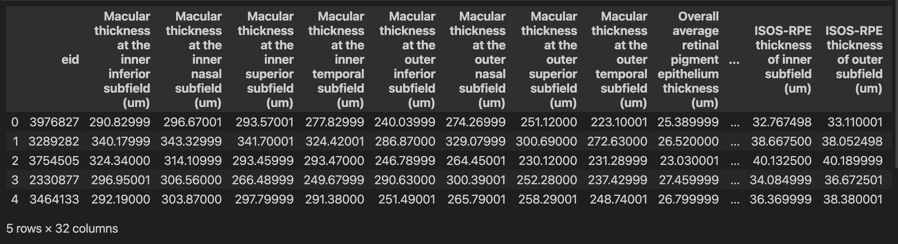

# OCT–Biomarker Alignment
OCT–Biomarker alignment performs CLIP-style semantic alignment between RETFound and 33 biomarkers from the UK Biobank.

## Download the weights for RETFound
Please download the OCT-based weights from the RETFound repository: [RETFound_MAE](https://github.com/rmaphoh/RETFound_MAE).

## Orginize the data
Please organize the data as:
- Dataset
  - training dataset
  - test dataset
  - training.csv
  - test.csv

The CSV files should be organized as shown in the figure below.



## Training Model
### 🔧 Install environment
1. Create environment with conda:

```bash
conda create -n Aignment python=3.11.0 -y
conda activate Alignment
```
2: Install dependencies
```bash
conda install pytorch==2.3.1 torchvision==0.18.1 torchaudio==2.3.1 pytorch-cuda=12.1 -c pytorch -c nvidia
git clone https://github.com/rmaphoh/RETFound_MAE/
cd RETFound_MAE
pip install -r requirements.txt
```
### 🔥 Model training
```bash
python multi_align.py
```
### ⚠️ Note
1: Some file paths in the code use absolute paths; please update them to your local paths before running.
2: During **CLIP-style alignment**, the model can suffer from **collapse**.  
**Model collapse** means the encoders learn **degenerate representations**: regardless of the input, the output features are almost identical (or vary only minimally). The training loss may look fine, but the representations have no discriminative power, so retrieval/classification performance degrades.

To catch collapse early, print the per-batch feature variance of the **unnormalized** projections in the training loop:

```python
var_img = zi_raw.float().std(dim=0).mean()
var_tab = zt_raw.float().std(dim=0).mean()
```
If these two values remain close to zero (e.g., **< 1e-5 for multiple consecutive steps**), the outputs are nearly constant—indicating that collapse is occurring (or imminent).

When this happens, first try:
- **Adjust the learning rate** (usually **lower** it).
- **Tune the contrastive loss temperature τ** (typically **increase τ** to reduce over-concentration).

Additionally consider:
- **Increase weight decay / regularization**.
- **Verify positive/negative pairing** is correct.
- **Increase the number of negatives** or the **batch size**.
- **Enable/strengthen normalization** in the projection head (e.g., BN/LayerNorm).
- Use **moderate augmentations** that preserve semantics.
- Apply **gradient clipping**, etc.


